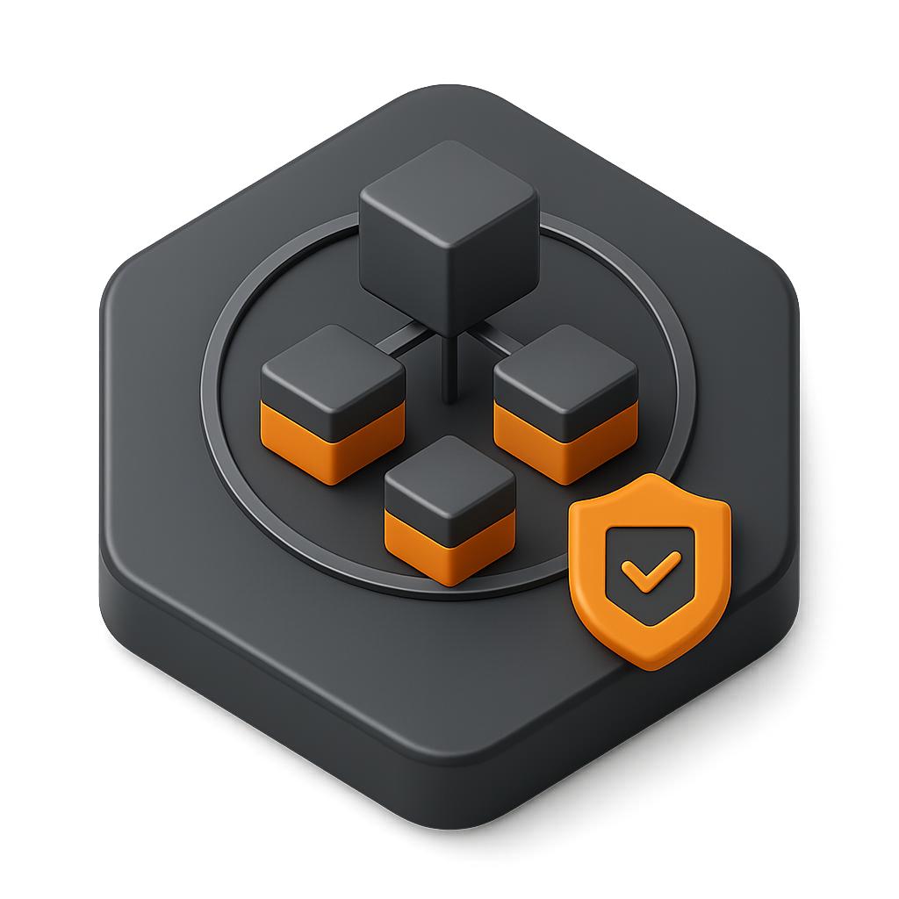
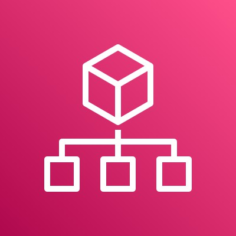
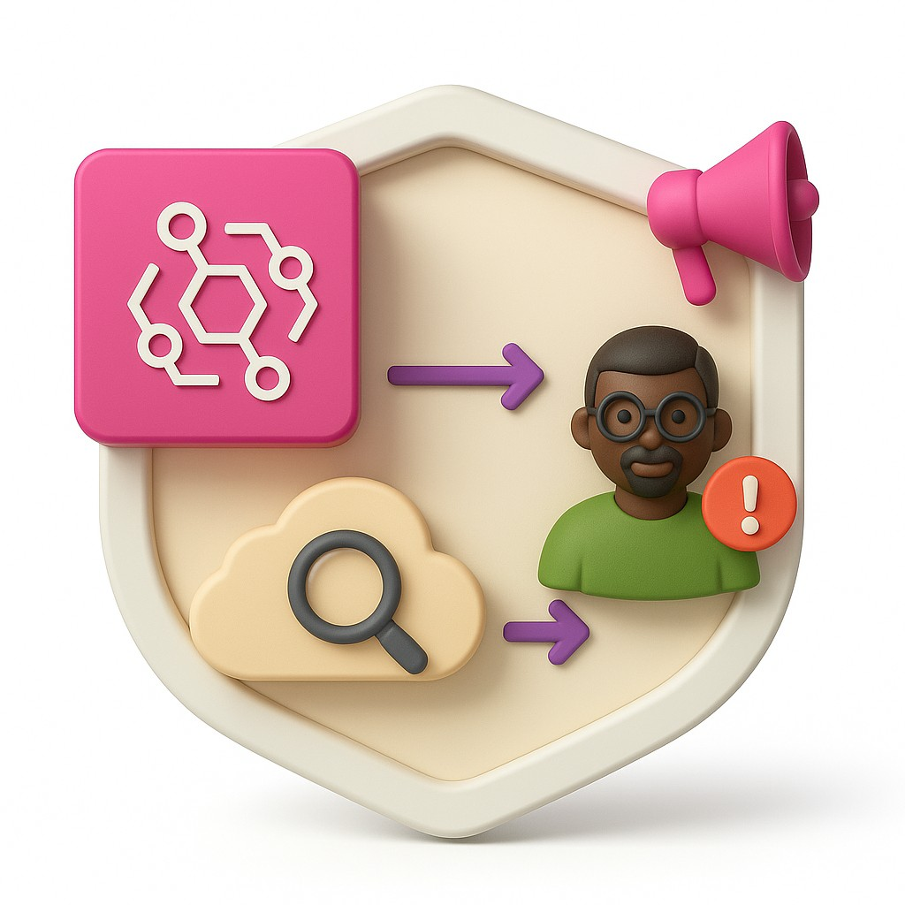
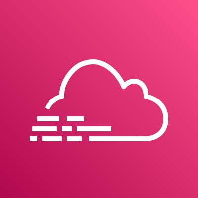
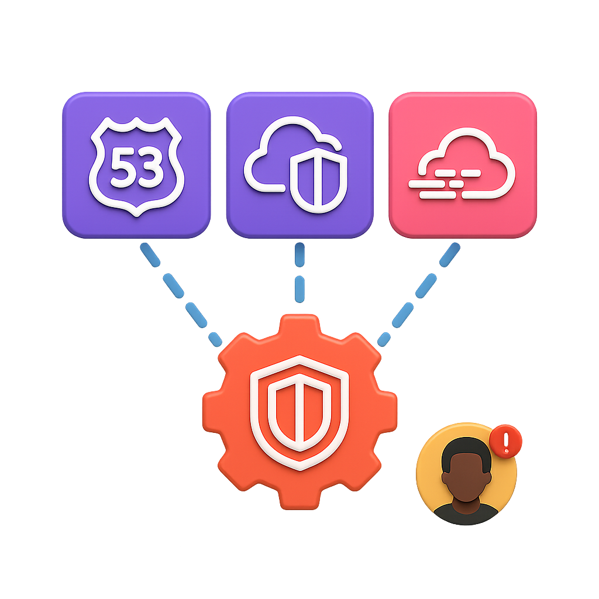
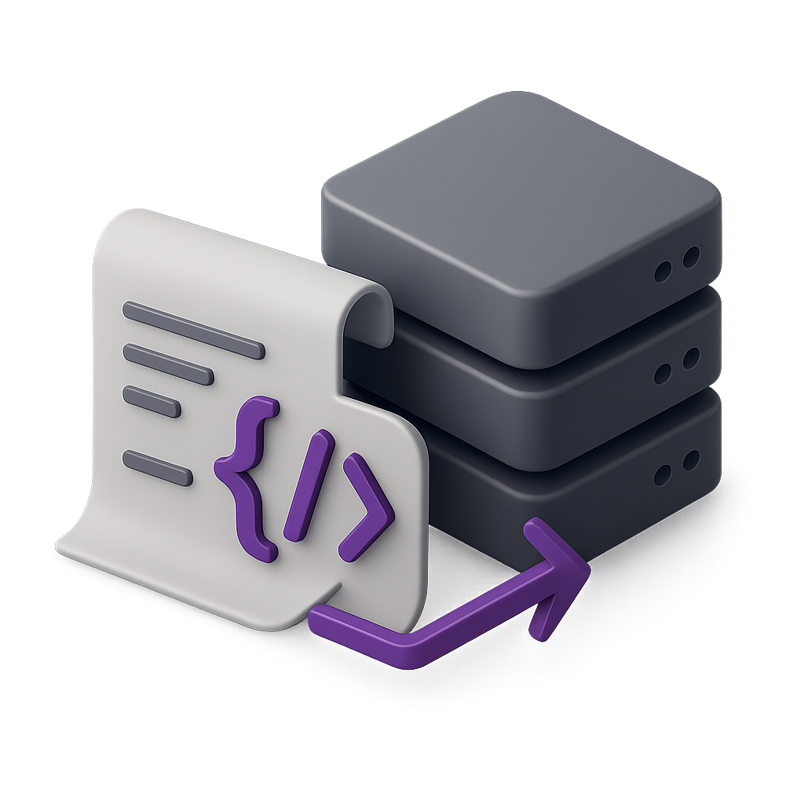
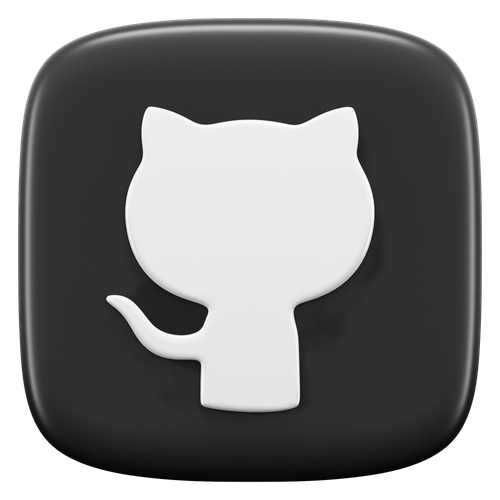

>  style="width:4.69293in;height:4.6875in" />

# Building A Secure Data Hub

> *Yiguedan Philippe Andy Yaro*

**<u>View Portfolio</u> <u>View Techinal Blog</u>**

# <u>Architecture Base</u>

## <u>Project Infrastructure Foundation</u>

**ORG.**

> **MANAGEMENT ACCOUNT**
>
> IAM
>
> **SCP**
>
> OrganizationAccountAccessRole
>
> **SCP**

Permission Sets

> **PROD UNIT**

**SCP**

> Data Account
>
> Client Account
>
> Security Account
>
>  style="width:0.83726in;height:0.75901in" /> style="width:0.66217in;height:0.66217in" />**ROOT UNIT**
>
> **DEV UNIT**
>
> TEAM
>
>  style="width:0.55585in;height:0.5575in" />
>
> Admin Account
>
> : Identity Center
>
> : Budget
>
> **\*SCP =** Service Control Policy

## <u>Project Infrastructure Foundation</u>

**ORG.**

> **MANAGEMENT ACCOUNT**
>
> Budget Alert
>
> 
>
> Data Account
>
> Billing

**SCP**

> Client Account
>
> Security Account
>
> Admin Account
>
> **PROD UNIT**

**SCP**

> Data Account
>
> Client Account
>
> Security Account
>
>  style="width:0.83726in;height:0.75901in" /> style="width:0.66217in;height:0.66217in" />**ROOT UNIT**
>
> **DEV UNIT**
>
> TEAM
>
>  style="width:0.55585in;height:0.5575in" />
>
> Admin Account
>
> : Identity Center
>
> : Budget
>
> **\*SCP =** Service Control Policy
>
> **<u>Identity Federation and Permissions</u>**

Permission Sets

Service Control Policy

> Permission Set : Resource Policy granting access

# <u>Request Flow Overview</u>

Domain Records

> Mngmnt. Account
>
> Gets redirected back to webpage, now retrieving his info.
>
> Client Account
>
> Certificate Manager
>
> Data Account
>
> Admin Account
>
>  style="width:1.0764in;height:1.0764in" />client.example.com
>
> <u>admin.example.com</u>

### Jack

> CDN
>
> Source Code
>
> DynamoDB

###  Admin

### 

API

> Lambda
>
> PK=id 2a 1j
>
> …
>
> Name Andy Jack
>
> Age 18
>
> 16
>
> Grade …
>
> F …
>
> A+ …

PK=cst SK

> Name
>
> Age
>
> PERSON Andy#2a Andy 18 }
>
> PERSON Jack#1j Jack 16

…

> Security Account
>
> Gets redirected to login UI to authenticate and get JWT back
>
> auth.example.com

>  style="width:0.83726in;height:0.75901in" />: Authentication :
> Retrieve/Update : One Time Operation / Static Configuration
>
> **<u>Request Flow
> Overview: Client-Side</u>**

Domain Records

> Mngmnt. Account

Certificate Manager

> Client Account
>
> Data Account
>
> client.example.com

OAC

SSE\*

> AWS
>
> Owned

### Jack

> CDN Source Code
>
> Bucket Policy

PK=id

> Name
>
> Age
>
> Grade

<table style="width:34%;">
<colgroup>
<col style="width: 8%" />
<col style="width: 8%" />
<col style="width: 8%" />
<col style="width: 8%" />
</colgroup>
<thead>
<tr>
<th>1j</th>
<th style="text-align: left;"><blockquote>

Jack

</blockquote></th>
<th style="text-align: left;"><blockquote>

16

</blockquote></th>
<th style="text-align: left;"><blockquote>

A+

</blockquote></th>
</tr>
</thead>
<tbody>
</tbody>
</table>

API

> 1j bc535
>
> …
>
> 67f1f5
>
> 13fe2

CSE\*

> Security Account

auth.example.com

> :Public :Private
>
> : Authentication
>
> : Retrieve/Update : One Time Operation / Static Configuration
>
> = DDB Endpoint
>
> **<u>Request Flow
> Overview: Admin-Side</u>**
>
> There are 3 roles at play here. The role in Admin App Acc.: it allows
> both lambda functions to assume either role in Data Acc., return info
> to api that invoked it.
>
> One role in Data Acc. is granted access to DDB base table for
> retrieval. It is allowed KMS operations. Logically, it is also granted
> access by key policy to use key to perform CSE.
>
> This role is the same used by Lambda from Client Acc..
>
> Second role in Data Acc. is only granted access to DDB summary table
> to retrieve summary info on clients. Both roles trust the role in
> Admin Account.

Domain Records

> Mngmnt. Account
>
> AWS
>
> Owned
>
> SSE\*
>
> Certificate Manager
>
> Data Account

OAC

> Admin Account
>
> <u>admin.example.com</u>
>
> PK=id 2a 1j
>
> …
>
> Name 0d236
>
> bc535
>
> Age 6f4922
>
> 67f1f5
>
> Grade e1dw 13fe2
>
> Bucket Policy
>
> “13fe2”
>
> Source Code

“A”

> CDN
>
> API

###  Admin

### 

>  style="width:0.2336in;height:0.2336in" />Customer Managed
>
> CSE\* \*

<table style="width:39%;">
<colgroup>
<col style="width: 9%" />
<col style="width: 9%" />
<col style="width: 9%" />
<col style="width: 9%" />
</colgroup>
<thead>
<tr>
<th><blockquote>

PK=cst

</blockquote></th>
<th>SK</th>
<th>Name</th>
<th><blockquote>

Age

</blockquote></th>
</tr>
</thead>
<tbody>
<tr>
<td><blockquote>

PERSON

</blockquote></td>
<td>Andy#2a</td>
<td>Andy</td>
<td><blockquote>

18

</blockquote></td>
</tr>
<tr>
<td><blockquote>

PERSON

</blockquote></td>
<td>Jack#1j</td>
<td>Jack</td>
<td><blockquote>

16

</blockquote></td>
</tr>
</tbody>
</table>

> }
>
> Security Account
>
>  style="width:0.83726in;height:0.75901in" />auth.example.com
>
> =
> DDB Endpoint
>
> : Authentication
>
> : Retrieve/Update : One Time Operation / Static Configuration
>
> :Public :Private

# <u>Logging & Monitoring</u>

> All API calls are
> logged in every account by CloudTrail. The logs are then written to a
> central bucket located in the Security Acc.: this is an Organization
> Trail. Log File Integrity is turned on to make sure log files are
> tampered.
>
> We’re also making sure that any unsuccessful attempt to do something,
> due to a lack of permission, notifies the admins. This makes sure that
> we have time to stop a privilege escalation for instance.
>
> EventBridge pulls these access denied/ unauthorized operation errors
> from internal streams. They are sent directly to the default event Bus
> in each account which forwards it to Bus in Sec. Acc..
>
> Admin is notified by SNS topic set as target to the Bus rule.
>
> All services are subject to failures. We need to make sure to
> remediate in a timely manner to these failures to keep our site/
> business running smoothly.
>
> Metrics and/or logs are sent directly from services to CloudWatch.
>
> An alarm is triggered if the threshold defined is exceeded in the case
> of metrics being directly sent. When it comes to logs, we define a
> metric filter and the output of logs —\> metric filter is metrics. An
> alarm is triggered if the threshold defined for the metrics is
> exceeded. In both cases, the Admin is notified via an SNS topic
> integrated with the alarm.
>
> It is important to note that the logs are not coming from CloudTrail.
> Indeed, CloudTrail cannot monitor a Lambda function failing to execute
> for example. CloudTrail records API activities and not service
> behavior.
>
> **<u>Organization-Wide
> Logging & Access Denied/Unauthorized Operation Alerts</u>**

Client Account

Data Account

Admin Account

APIGW

Lambda

KMS

DynamoDB

APIGW

Lambda

Cognito

> Security Account

: Organization Trail

> : Monitoring through EventBridge
>
> : Log files Bucket : CloudTrail : EventBridge : SNS Topic

Security. Account

Admin Account

Cognito

Lambda

APIGW

> Client Account
>
> Data Account
>
> Route53
>
> APIGW Lambda
>
> KMS DynamoDB

: Service Operations Logs

> : Alarm triggered/Admin notified
>
> : CloudWatch : SNS Topic

# <u>Threat Detection</u>

> GuardDuty when enabled
> in the account starts automatically pulling logs from VPC Flow logs,
> Route 53 resolver query logging and CloudTrail management events
> internal streams. There is no need to turn them on manually.
>
> After being enabled, the service is going to start analyzing the logs
> as a whole, and use machine learning to detect threats as they occur.
>
> These threats are referred to as findings. The service is integrated
> with SNS to notify the admin.
>
> It is to note that GuardDuty, in the first 2 weeks is not going to be
> generating findings, because it is still unfamiliar with normal
> behavior in the account.

# <u>Threat Detection</u>

> Mngmnt. Account
>
> Client Account
>
> Security. Account
>
> Admin Account
>
> Data Account
>
> Route53
>
> VPC CloudTrail
>
> Route53 VPC CloudTrail
>
> Route53 VPC CloudTrail
>
> Route53 VPC CloudTrail
>
> Route53 VPC CloudTrail
>
> Finding: **Policy:S3/BucketAnonymousAccessGranted**
>
>  style="width:0.56862in;height:0.56862in" /> style="width:0.56862in;height:0.56862in" /> style="width:0.83726in;height:0.75901in" />*Alert is done* th*rough
> in*te*gra*tí*on wi*th *SNS*
>
> : Logs streamed internally
>
> : GuardDuty collecting from internal streams of logs
>
> : VPC Flow Logs : Route53 Resolver Query Logging : CloudTrail
> Management Events
>
> **<u>Infrastructure as Code</u>**

>  style="width:1.1in;height:1.1in" />
>
>  style="width:0.91841in;height:0.91841in" /> style="width:1.01695in;height:1.01695in" /> style="width:0.83726in;height:0.75901in" />: Terraform : GitHub :
> GitHub Actions
